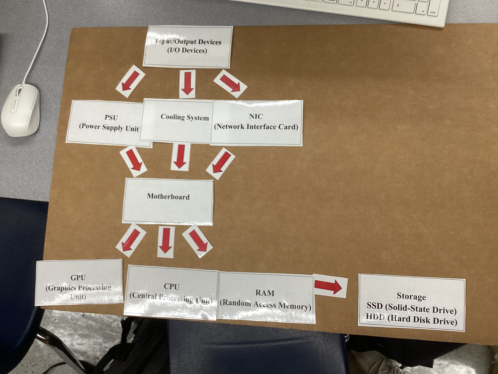
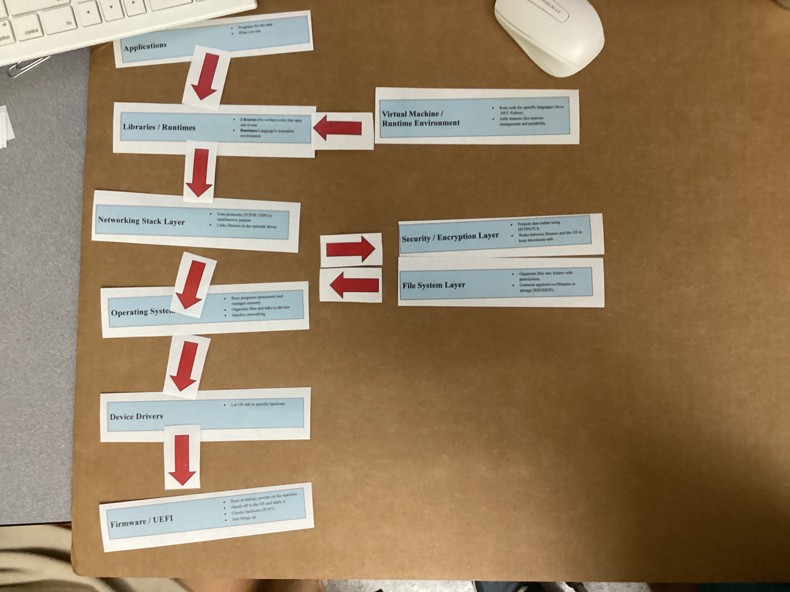

# 1. Project Overview

**Problem Statement:** 
This project helped us learn all of the different parts of a computer and their functions.

**Objectives:**  
- Identify main hardware components (CPU, RAM, GPU, Storage, Motherboard, PSU, NIC, Cooling System, I/O Devices).  
- Describe the function of each component.  
- Trace the path of data through hardware during typing and saving a file.  
- Understand software layers (Firmware/UEFI, Drivers, OS, Libraries/Runtimes, Applications).  

**Success Criteria:**  
- Complete hardware card arrangement correctly for the typing/saving exercise.  
- Correctly map software layers and interactions.  
- Document choices, reflections, and explanations.  

---

# 2. Design & Planning

## Computer Components Guide

| Component | Description |
|-----------|-------------|
| **CPU (Central Processing Unit)** | **What it is:** The "brain" of the computer.<br>**What it does:** Executes instructions from programs: performing calculations, logic, and decision-making. Every click, keystroke, and program command eventually passes through the CPU.<br>**Why it matters:** The CPU’s speed and efficiency determine how quickly tasks are processed—whether you’re browsing the web, running a game, or performing complex simulations. |
| **RAM (Random Access Memory)** | **What it is:** The computer’s short-term working memory.<br>**What it does:** Temporarily stores the data and instructions that the CPU is currently using. Unlike storage drives, RAM is wiped clean when the computer is turned off.<br>**Why it matters:** More RAM allows more programs to run at once and at the same time without slowing down the system. |
| **Storage (SSD / HDD)** | **What it is:** The computer’s long-term data storage.<br>**What it does:** Holds your operating system, applications, files, and personal data—even after the power is turned off.<br>**SSD:** Uses flash memory with no moving parts, allowing faster speed and durability.<br>**HDD:** Uses spinning magnetic disks, offering more storage for a lower cost but at slower speeds.<br>**Why it matters:** The type and size of storage affect how fast your computer boots, loads programs, and accesses files. |
| **GPU (Graphics Processing Unit)** | **What it is:** A processor specialized in handling graphics, images, and video.<br>**What it does:** Renders images for your monitor and accelerates tasks that involve heavy parallel processing, such as video editing, 3D modeling, and machine learning.<br>**Why it matters:** A strong GPU improves gaming graphics, speeds up creative workflows, and supports scientific computing tasks. |
| **Motherboard** | **What it is:** The main circuit board inside the computer.<br>**What it does:** Connects all hardware components (CPU, RAM, storage, GPU, PSU, NIC, etc.) and allows them to communicate via data pathways called “buses.”<br>**Why it matters:** The motherboard determines compatibility between components and affects system expandability. |
| **PSU (Power Supply Unit)** | **What it is:** The device that provides power to the computer.<br>**What it does:** Converts electricity from your wall outlet (AC power) into the low-voltage DC power that internal components use.<br>**Why it matters:** A PSU with insufficient power or poor quality can cause instability, damage components, or prevent the system from running. |
| **NIC (Network Interface Card)** | **What it is:** A hardware component for connecting to a network.<br>**What it does:** Translates data between the computer and the network—whether that’s a wired Ethernet connection or wireless Wi-Fi (when integrated with a wireless adapter).<br>**Why it matters:** The NIC affects connection speed, reliability, and the ability to join networks. |
| **Cooling System** | **What it is:** Fans, heat sinks, liquid cooling, or other systems that remove heat from components.<br>**What it does:** Prevents overheating, which can slow down the computer (thermal throttling) or damage parts.<br>**Why it matters:** Efficient cooling extends hardware lifespan and allows components to run at full speed. |
| **Input/Output Devices (I/O Devices)** | **What they are:** The tools you use to interact with the computer.<br>**Input devices:** Send data to the computer (keyboard, mouse, microphone, scanner).<br>**Output devices:** Display or output information from the computer (monitor, speakers, printer).<br>**Why they matter:** They are the user’s main way to give commands and receive results from the system. |


## Hardware Card Arrangment with Comparison
First diagram (Image 1):
Layout is more vertical and linear.
Information flows mostly top-to-bottom, with the motherboard in the center and arrows pointing outward to GPU, CPU, RAM, and storage. It’s simpler, easier to follow, but less detailed about the back-and-forth relationships between parts.


Second diagram (Image 2):
Layout is more spread out and complex, showing multiple directions of data and power flow.
Uses more arrows, including loops, to show two-way connections (e.g., between CPU, RAM, NIC, GPU, and I/O devices).
It gives a clearer sense of interaction between components, but looks more cluttered compared to the first.


## Software Card Arrangment
This diagram shows the layers of computer software, from bottom to top. At the base is Firmware/UEFI, which starts the machine. Above that are Device Drivers, which let the operating system talk to hardware. The Operating System manages programs and hardware, while the Networking Stack handles internet connections. Libraries and Runtimes give apps extra code they need, and Applications are the programs people use. On the side, extra layers like Virtual Machines, Security/Encryption, and the File System add protection, file organization, and support for different programming environments.


## PC Upgrade Plan (Budget: $1000)

### CPU – Mid-range 6-core processor ($150)
- **Upgrade Chosen:** $150 CPU  
- **Why This Matters:** A mid-range CPU makes the computer run faster and smoother, especially for gaming and multitasking. It ensures the system can keep up with demanding applications without slowing down.

---

### RAM – 16 GB total RAM ($150)
- **Upgrade Chosen:** $150 RAM  
- **Why This Matters:** 16 GB of RAM allows the computer to load programs and games more quickly. It also helps with multitasking, so you can run multiple applications without lag.

---

### GPU – High-end graphics card ($400)
- **Upgrade Chosen:** $400 GPU  
- **Why This Matters:** A powerful GPU gives high-quality graphics for games and other graphics-heavy tasks. It improves frame rates, visual effects, and overall gaming performance.

---

### NIC – 2.5 Gbps network card ($100)
- **Upgrade Chosen:** $100 NIC  
- **Why This Matters:** A faster network card improves online gaming by reducing lag and keeping connections stable. It ensures smoother multiplayer experiences.

---

### Cooling System – Liquid cooling system ($200)
- **Upgrade Chosen:** $200 Cooling System  
- **Why This Matters:** A liquid cooling system prevents overheating during long or high-load gaming sessions. This keeps the system reliable and extends the lifespan of components.

---

### Total Cost: $1000

---

# 3. Lyrics for Component Song
[Verse]
The CPU's the brain
The mastermind
It crunches numbers
Keeps time aligned
Motherboard's the heart
Circuits intertwine
A web of pathways
Electric design
[Prechorus]
Storage holds the tales untold
Bits and bytes
The stories unfold
[Chorus]
Click-clack
The keys ignite
Screen lights up
Pixels in flight
Hard drive spins
It saves my view
Every part's got a job to do
[Verse 2]
The RAM’s the sprinter
Fast on its feet
Temporary thoughts
Quick and discreet
The GPU paints
Colors the scene
A masterpiece on every screen
[Bridge]
The fan's the wind
A cooling breeze
Keeps it calm
Keeps it at ease
The power supply’s the mighty spark
Lights the system
Ignites the dark
[Chorus]
Click-clack
The keys ignite
Screen lights up
Pixels in flight
Hard drive spins
It saves my view
Every part's got a job to do

# 4. AI Generated Component Song 


# 5. Reflection for Component Hardware and Software

This project taught me how both hardware and software components work together to make a computer work. I learned the roles of CPU, RAM, GPU, storage devices, and I/O devices. Mapping the data flow when typing and saving a document helped me understand the how components worked with each other and communicate. Working with software strips also helped me understand how applications, libraries, OS, drivers, and firmware interact. During the Build-A-PC challenge, I had to make upgrade decisions, which taught me about performance real-world planning. I now better understand why drivers are essential. Next steps include practicing more networking configuration and maybe buildinhg another pc in the future. 

---

# 6. Project Overview

**Problem Statement:**  
This project helped us practice building a communication system without speaking, writing, or gesturing — only using blue and white cards.

**Objectives:**  
- Design a system to send numbers, months, and yes/no responses using cards.  
- Test the system with a partner to check if the message can be understood the first time.  
- Reflect on misunderstandings and redesign for better clarity.  

**Success Criteria:**  
- Create a working card “language.”  
- Partner can understand the number, month, and yes/no answer on the first try.  
- Document design, testing, and reflection.  

---

# 7. Design & Planning

## Card System Plan

| Element | Method |
|---------|--------|
| **Numbers** | Flip the card over to count each number (e.g., 3 flips = number 3). |
| **Months** | Continue flipping until you land on the correct month (e.g., October). |
| **Yes/No** | Blue = Yes, White = No. |

---

## Pseudocode Representation

```python
# Yes/No Rule
if card_color == "blue":
    response = "Yes"
elif card_color == "white":
    response = "No"

# Numbers
number = flip_count  # e.g., 3 flips = number 3

# Months
month = flip_count_until_target  # keep flipping until October

# 8. Reflection for Silent Signals
I learned that making a communication system without words is difficult because meanings can easily get mixed up. My first system failed because the writing wasn’t clear. Then we tried colors, but “blue” could mean different things, which caused confusion. The flipping system worked better because it gave a clear way to count numbers and show months. From this project, I learned that a good communication system needs simple, consistent, and easy-to-remember rules. If I did this again, I would make the meanings even simpler and test with more partners to make sure it always works.

