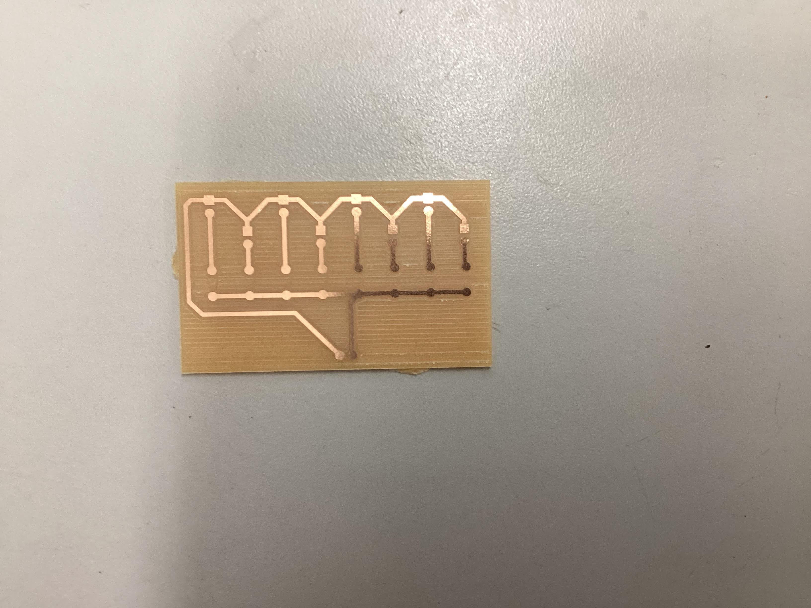

# CNC PCB Milling Log

This repository documents my progress learning CNC PCB design and milling — from creating the design file to producing a final physical board.

---

## 2025-10-27
**Activity:**  
Created the CNC file in MakerCAD following the provided tutorial.

**Details:**  
Learned how to use MakerCAD to generate the toolpaths and export the file format required for PCB milling. Followed the step-by-step process to understand how traces and cutouts are defined.

**Reflection:**  
This was a solid introduction to the workflow. The tutorial helped clarify the coordinate setup and how to properly define the tool diameter for accurate milling. There was some initial confusion about exporting the correct file type, but rechecking the tutorial solved it.

---

## 2025-10-28
**Activity:**  
Created the CNC file independently for practice.

**Details:**  
Repeated the process without the tutorial to reinforce understanding. Focused on creating clean trace paths and ensuring all connections were correctly aligned before exporting the file.

**Reflection:**  
Working independently helped build confidence with the CNC design process. Some alignment issues occurred initially, requiring rework of the trace layout. After adjustments, the final file matched the expected output. This was valuable practice for the actual board.

---

## 2025-10-30
**Activity:**  
Printed the CNC file and learned how to use the milling machine.

**Details:**  
Used the prepared CNC file to mill the PCB. Learned how to set up the machine, position the material, and monitor the milling process to ensure the traces were cut accurately.

**Reflection:**  
It was exciting to see the digital design turn into a physical board. The biggest challenge was understanding how to correctly zero the machine to avoid cutting too deep or too shallow. After a few adjustments, the milling ran smoothly.

---

## 2025-10-31
**Activity:**  
Received the final PCB and inspected the board.

**Details:**  
Checked the milled board for any broken traces, shorts, or rough edges. Verified that all connections matched the design and that the board was ready for component soldering.

**Reflection:**  
The final board turned out well. The traces looked clean, and everything matched the original design. It was rewarding to see the full process—from CAD design to final physical PCB—come together successfully.

---

## Key Decisions During the Project
To document the important decisions made throughout the process:
- Trace Width Selection: Chose a width that balanced manufacturability and spacing, ensuring the milling bit could isolate each trace cleanly.
- Tool Diameter Choice: Selected a bit size that matched the smallest trace clearance to avoid overcutting.
- Board Outline Size: Adjusted the outline to match the actual copper-clad board to avoid cutting off the edge.
- Cutting Depth: Increased depth slightly after early cuts were too shallow, ensuring copper was fully removed without damaging material.
- Alignment Corrections: Reworked several traces during the independent practice session to achieve proper spacing and avoid shorts.

## Project Files

- **CNC Design File (.mkc):** [link](DanielLokasTest.mkc)  
- **CNC Toolpath File (.nc):** [link](DanielLokasgcode(1).nc)
- **KiCad Files** [link](pcb_milling_files.zip)

---

## Workflows & Documentation

**CNC Workflow:**
- Open MakeraCam
- Open project 3-axis
- File → Import PCB → select Edge Cuts.gbr file
- File → Import PCB → select F.Cu layer to add top layer copper file
- File → Import PCB → select Resistance1-PTH.drl (drill file) to mark where the CNC should drill holes into the board
- Select board and press M, set the anchor to the bottom left corner and move board to (6, 6)
*Note: If the object is dotted, it is selected. If it is solid, then it is not selected*
- Go to top line, hit shift key and deselect the top line
- Block the bottom three files
- Select 2D Pocket to add a toolhead to the CNC
- Set end depth to 0.05mm
- Go to add tool → 0.8mm Corn
- Go to add tool → 0.2mm*30 Engraving(Metal)
- Select choose
- Click calculate
- Block everything but the drl files
- Select everything and select 2D drilling
- Set drill tip end depth to 1.7mm
- Just add the 0.8mm Corn tool
- calculate
- Block everything but resistance edge cuts (Deselect top line and select bottom line)
- 2D contour
- End depth 1.7mm
- Tool 0.8mm Corn
- Strategy: position is outside
- Go to tabs → Custom → tabs → add → click on selected box (you want 3 tabs)
*Note: Don’t put tabs across each other! It will break the board. Make sure to offset them slightly*
- Click preview at the top

**CNC Machine Workflow:**
- First put the copper in the corner
- Tighten the bolts near the inside of the copper to hold it in place
- Tighten the bracket to help hold the copper in place(make sure the small side is the one holding the copper down)
- Then go to carver controller software
- Download your gcode file
- Press open gcode in the bottom left and select and upload the gcode file you are using
- After file uploaded hit run gcode in bottom left(to the right of open gcode)
- Once you are in config and run
- Auto vacuum: on
- Select scan margin
- Select auto leveling
- Click run (ensure the voltage is above 3.6 before running)

---

## Photo Documentation
MakerCAD Design Screenshot
  

Screenshot of the PCB layout created in MakerCAD showing traces, pads, and the board outline before generating toolpaths.

Toolpath Preview Screenshot
  

Generated CNC toolpaths for isolation routing and cutting, used to verify that trace spacing and cut depths were correct before milling.

Board After Milling (Before Cleaning)
  

The freshly milled PCB immediately after the machine finished cutting, showing isolated traces and copper debris prior to cleaning.

---

## Final Reflection

Throughout this project, one of the main challenges was ensuring that the digital measurements in MakerCAD matched the physical dimensions of the board material used for milling. The first few attempts revealed slight mismatches in trace spacing and board size, which required recalibrating the CNC machine and double-checking the scaling within the software. This experience emphasized the importance of verifying units, toolpath precision, and material thickness before printing.

Another learning point was understanding how tool zeroing and cutting depth directly affect the trace quality. Initially, the cuts were too shallow, leaving excess copper, but careful re-zeroing and testing resolved the issue. Seeing the effect of just fractions of a millimeter on final trace quality taught me how precise CNC milling truly is.

Additionally, choosing the correct tool diameter mattered more than expected. A larger bit could have destroyed fine traces, while a smaller one increased milling time. Balancing these trade-offs helped reinforce the engineering behind fabrication.

Overall, successfully producing a clean and accurate PCB was a rewarding milestone. This project helped strengthen my understanding of the entire CNC workflow—from CAD design to fabrication—and built confidence in troubleshooting, precision measurement, and digital manufacturing techniques.

---
