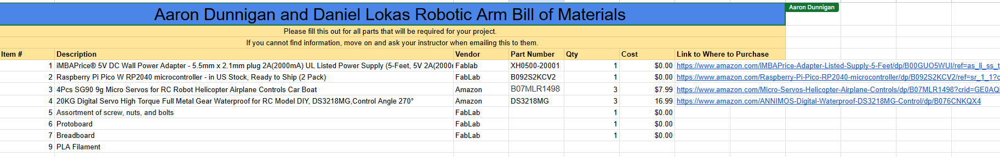

# Adaptive Arm-Based Beverage Delivery System  
**Capstone Project — Pearl Rehab Center**

---

## Project Status
**In Progress**  
This project is currently under active development. Design, prototyping, and testing are ongoing, and no final hardware or software implementation has been completed yet.

### Design Spec Sheet
[Link](https://docs.google.com/document/d/1RlveuHIZWM5QWMhkt3ebb2Dl6V2vLC_BaKYv-PvAG7E/edit?usp=sharing)

---

## Project Overview

The **Adaptive Arm-Based Beverage Delivery System** is a mechanical assistive device being developed in collaboration with **Pearl Rehab Center**. The goal of this project is to design a **robotic arm with a self-balancing cup holder** that helps individuals with limited mobility independently access beverages.

The system is intended to:
- Hold a standard drinking cup
- Stabilize the cup during movement
- Move the cup toward the user in a controlled and safe manner

The device will be **3D printed** and controlled using an **Arduino-based system**, with servo motors enabling smooth, precise motion.

---

## Why This Project Was Chosen

This project was selected because it:
- Addresses a **real-world accessibility challenge**
- Serves a **specific rehabilitation center and user group**
- Combines **mechanical design, electronics, and programming**
- Aligns with assistive-technology principles of independence and dignity

A successful version of this project would allow users with limited upper-body mobility to drink without requiring constant assistance from caregivers.

---

## Inspiration & Prior Art 

This project draws inspiration from existing assistive and robotic arm projects, including:
- **past robotic arm project** — Original author/maker: **Aaron Dunnigan**

### How This Project Will Differ
- Designed specifically for **rehabilitation center use**
- Focused on **cup stabilization and user safety**
- Modular design for future customization
- Emphasis on affordability and 3D-printable components

---

## Design Specifications (In Progress)

Key design considerations include:
- Range of motion appropriate for seated users
- Self-balancing cup holder mechanism
- Motor torque vs. speed tradeoffs
- Mounting method (table, wheelchair, or bed-side)
- User safety and spill prevention

**Design Specification Considerations Document:**  
N/A bc I am a coder 

---

## Planned System Components

### Mechanical
- 3D-printed robotic arm segments
- Self-balancing cup holder mechanism
- Mounting bracket system

### Electronics
- Arduino microcontroller
- Servo motors (model TBD)
- Power supply (TBD)
- Wiring and connectors

### Software
- Arduino control code
- Servo motion control logic
- Safety limits and motion constraints

---

## Bill of Materials 

---

## Tools & Equipment (Planned)

### Digital Tools
- Arduino IDE
- Fusion 360 (CAD)

### Fabrication Tools
- 3D Printer
- Hand tools (screwdrivers, hex keys)
- Fab Lab equipment (as needed)

---

## Files to Be Included (As Project Progresses)

- Arduino source code (`.ino`)
- Fusion 360 design files (`.f3d`)
- STL files for 3D printing
- Wiring diagrams
- Documentation and images

---

## Project Timeline

- **Upcoming Milestones**
  - CAD modeling of arm components
  - First 3D-printed prototype
  - Arduino motion testing
  - Cup stabilization testing
  - Iterative refinement based on feedback

---

## Documentation of Learning 

This section will include:
- Journal entries
- Key design decisions and reasoning
- Challenges encountered during prototyping

## Journal Entries for Final Project:
- **9-18-2025**  
  Committed to working with Pearl Rehab Center and began research into existing assistive technologies.

- **10-1-2025**  
  Researched cup holder mechanisms and mounting systems.  
  Evaluated servo motor options for the robotic arm.  
  Collaborated with Aaron to define design requirements and produced an initial system sketch.

- **10-8-2025**  
  Refined overall project concept and clarified system goals.  
  Began planning the mechanical arm structure and self-balancing cup holder approach.

- **10-15-2025**  
  Began preliminary CAD planning for robotic arm components.  
  Considered joint layout, range of motion, and modular design for 3D printing.

- **10-22-2025**  
  Planned Arduino control approach and basic servo wiring layout.  
  Researched motion control strategies and safety considerations.

- **10-29-2025**  
  Prepared for initial prototyping and identified required materials and print settings.  
  Reviewed design assumptions and noted areas for iteration.

- **11-6-2025**  
  Reviewed project requirements and accessibility goals for users with limited mobility.  
  Refined ideas for how the robotic arm would approach and deliver a cup safely.

- **11-7-2025**  
  Continued research on self-balancing cup holder mechanisms.  
  Looked into passive vs. active stabilization approaches.

- **11-8-2025**  
  Sketched alternative cup holder and arm joint concepts.  
  Considered how center of gravity affects spill prevention.

- **11-13-2025**  
  Began outlining the mechanical structure of the robotic arm.  
  Considered joint count, arm reach, and mounting options.

- **11-14-2025**  
  Researched Arduino-compatible servo control methods.  
  Reviewed example Arduino servo projects for reference.

- **11-18-2025**  
  Compared different servo motor torque ratings and sizes.  
  Evaluated tradeoffs between strength, precision, and cost.

- **12-8-2025**  
  Reviewed overall system design and identified components needing further refinement.  
  Updated project documentation to reflect current progress.

- **12-10-2025**  
  Planned next steps for CAD modeling and prototyping.  
  Organized research notes and reference materials.

- **12-11-2025**  
  Continued refining design ideas for the self-balancing cup holder.  
  Considered how the cup holder will interface with the arm.

- **12-14-2025**  
  Reviewed safety considerations related to user interaction and motion limits.  
  Noted potential improvements to reduce spill risk.

- **12-16-2025**  
  Prepared for upcoming fabrication and electronics work.  
  Finalized short-term goals for continuing development of the project.

---

## Current Challenges 

- Balancing strength vs. smooth motion
- Designing a reliable self-balancing cup mechanism
- Ensuring user safety
- Keeping the system affordable and maintainable

---

## Next Steps

- Finalize mechanical design concepts
- Test servo control logic
- Build and evaluate early prototypes

---

## Summary

This capstone project is an ongoing effort to design a practical assistive device that supports independence for individuals with limited mobility. Through collaboration with Pearl Rehab Center, the project emphasizes real-world usability, thoughtful design, and iterative problem solving. As development continues, documentation, testing, and refinement will guide the system toward a functional and meaningful outcome.

---

**Name:** [Daniel Lokas]  
**Course:** [Senior Engineering]  
**Instructor:** Mr. Dubick]  
**School:** [Charlotte Latin School]
