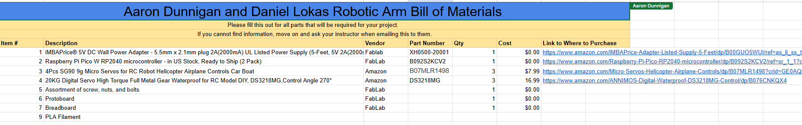

# Adaptive Arm-Based Beverage Delivery System  
**Capstone Project — Pearl Rehab Center**

---

## Project Status
**In Progress**  
This project is currently under active development. Design, prototyping, and testing are ongoing, and no final hardware or software implementation has been completed yet.

---

## Project Overview

The **Adaptive Arm-Based Beverage Delivery System** is a mechanical assistive device being developed in collaboration with **Pearl Rehab Center**. The goal of this project is to design a **robotic arm with a self-balancing cup holder** that helps individuals with limited mobility independently access beverages.

The system is intended to:
- Hold a standard drinking cup
- Stabilize the cup during movement
- Move the cup toward the user in a controlled and safe manner

The device will be **3D printed** and controlled using an **Arduino-based system**, with servo motors enabling smooth, precise motion.

---

## Why This Project Was Chosen

This project was selected because it:
- Addresses a **real-world accessibility challenge**
- Serves a **specific rehabilitation center and user group**
- Combines **mechanical design, electronics, and programming**
- Aligns with assistive-technology principles of independence and dignity

A successful version of this project would allow users with limited upper-body mobility to drink without requiring constant assistance from caregivers.

---

## Inspiration & Prior Art 

This project draws inspiration from existing assistive and robotic arm projects, including:
- **past robotic arm project** — Original author/maker: **Aaron Dunnigan**

### How This Project Will Differ
- Designed specifically for **rehabilitation center use**
- Focused on **cup stabilization and user safety**
- Modular design for future customization
- Emphasis on affordability and 3D-printable components

---

## Design Specifications (In Progress)

Key design considerations include:
- Range of motion appropriate for seated users
- Self-balancing cup holder mechanism
- Motor torque vs. speed tradeoffs
- Mounting method (table, wheelchair, or bed-side)
- User safety and spill prevention

### Additional Design Constraints

During the design process we identified several additional constraints that affect how the device should be built.

**Weight Distribution**  
The robotic arm must remain stable when holding a filled cup. If the arm extends too far or becomes too heavy, the base could tip or become unstable.

**Printability**  
Because most of the parts are 3D printed, the design must be printable using common printer settings. Parts with very thin walls or unsupported overhangs may fail during printing.

**Ease of Assembly**  
The device should be easy to assemble and repair. Using modular parts makes it easier to replace individual components if something breaks.

**Cost Accessibility**  
One goal of the project is to keep the device affordable so that similar systems could realistically be used in rehabilitation centers or homes.

**Design Specification Considerations Document:**  
[Link](https://docs.google.com/document/d/1RlveuHIZWM5QWMhkt3ebb2Dl6V2vLC_BaKYv-PvAG7E/edit?usp=sharing)

---

## Planned System Components

### Mechanical
- 3D-printed robotic arm segments
- Self-balancing cup holder mechanism
- Mounting bracket system

### Electronics
- Arduino microcontroller
- Servo motors (model TBD)
- Power supply (TBD)
- Wiring and connectors

### Software
- Arduino control code
- Servo motion control logic
- Safety limits and motion constraints

---

## Bill of Materials 

---

## Tools & Equipment (Planned)

### Digital Tools
- Arduino IDE
- Fusion 360 (CAD)

### Fabrication Tools
- 3D Printer
- Wire strippers for preparing electrical connections
- Small pliers for adjusting wires and connectors
- Digital calipers to measure printed parts and verify dimensions
- Computer simulation tools inside Fusion 360 to visualize the arm structure before printing

---

## Files to Be Included (As Project Progresses)

- Arduino source code: [code](https://docs.google.com/document/d/1JzSWEezLwWs6ETRjX4n0eiQ5AaLUB9aJAykjetHIvts/edit?usp=sharing)
- STL files for 3D printing: [print](https://drive.google.com/file/d/18iG6IoLDqeNWONsQEqfif6LjOAfSxby3/view?usp=sharing)

---

## Project Timeline

- **Upcoming Milestones**
  - CAD modeling of arm components
  - First 3D-printed prototype
  - Arduino motion testing
  - Cup stabilization testing
  - Iterative refinement based on feedback

### Timeline Reflection

Although the project started with a planned timeline, several parts of the process required more time than expected. This is common in engineering projects because prototypes often reveal problems that were not obvious during the design phase.

For example, several early versions of the cup holder failed during printing. These failures required redesigning the model with thicker walls and better support structures. In addition, researching the correct servo motors took longer than expected because we needed to balance torque, speed, and safety.

Even though the timeline shifted, each challenge helped improve the design and provided valuable learning experience.

---

## Documentation of Learning 

This section will include:
- Journal entries
- Key design decisions and reasoning
- Challenges encountered during prototyping

### Important Design Decisions

Throughout the project we had to make several key design decisions.

One important decision was reducing the number of arm joints. At first we considered building a more complex arm with additional joints, but this would make the system harder to control and less reliable. We decided to simplify the design to improve stability.

Another important decision was selecting medium-torque servo motors instead of smaller micro servos. Smaller servos did not provide enough strength to hold a filled cup, while very large servos could move too quickly and create safety concerns.

We also decided that the arm should move slowly rather than quickly. Since the device operates close to a person's face and upper body, smooth and predictable motion is more important than speed.

## Journal Entries for Final Project:
- **9-18-2025**  
  Committed to working with Pearl Rehab Center and began research into existing assistive technologies.

- **10-1-2025**  
  I researched different assistive technology projects and focused on ideas that could realistically help people with limited mobility. I specifically looked at cup holders and robotic arm systems to understand how they work and what problems they solve. I also started thinking about how this project could be designed for real use at Pearl Rehab Center instead of just as a demonstration. Also printed the first model
  ****

- **10-8-2025**  
  Me and Aaron did research on the different servos and were deciding if we should use the smaller SG90 9g Micro Servos because we are changing the arm to not have fingers. 

- **10-15-2025**  
  I started planning the mechanical structure of the robotic arm, including how many joints it should have and how much reach it needs. I considered how joint placement affects strength and stability, especially when holding a full cup.

- **10-22-2025**  
  I researched how Arduino boards control servo motors and looked at example projects to understand basic wiring and programming. I learned how servo angles are controlled and how movement speed can be adjusted through code.

- **10-29-2025**  
  After completing research on the servos needed we modified the bill of materials to accurately reflect how we needed 2 9g micro servos instead of the original 4 because we will not have fingers on the arm. 

- **11-6-2025**  
  Reviewed project requirements and accessibility goals for users with limited mobility.  
  Refined ideas for how the robotic arm would approach and deliver a cup safely.

- **11-7-2025**  
  Worked on a second model for the self stablizing cup holder with a built-in cup at the bottom instead of putting one inside, which failed the first time.
  

- **11-8-2025**  
  Sketched alternative cup holder and arm joint concepts. Considered how center of gravity affects spill prevention. Also tested the cup holder by attaching it to a wooden piece and filling a cup with water. 

- **11-13-2025**  
  I continued planning the arm structure and thought more carefully about joint count and arm reach. I realized that adding too many joints would make the system harder to control and less reliable. Also finalized the cup holder mechanism and here is a photo of the file.
  

- **11-14-2025**  
  I looked deeper into how servo motors are controlled with Arduino, including how speed and smoothness can be adjusted in code. I also reviewed common servo issues like jitter and overloading. This helped prepare me for choosing the right servos and programming safer motion later.

- **11-18-2025**  
  Aaron and I researched different servo motors to see which ones would work best for the robotic arm. We looked at torque ratings, sizes, and cost, and compared small micro servos to larger metal-gear servos. The smaller servos were too weak to safely hold a cup, especially when the arm is extended. The larger, very high-torque servos seemed unnecessary and could move too aggressively near a user.

From this research, we decided that a medium-torque servo would be the best option for prototyping because it provides enough strength while still allowing smoother, safer movement. This helped guide the direction of the arm design moving forward.

- **12-8-2025**  
  Reviewed overall system design and identified components needing further refinement. Also updated my project documentation with the problems for the printing of the cup holder and the new servo decisions

- **12-11-2025**  
  I tried printing the self-balancing cup holder multiple times. Two of the prints failed completely, and one only printed about halfway before stopping. These failures showed that the design had weak areas, thin walls, and was difficult to print in its current orientation.

Based on this, I realized the design needs to be simplified and reinforced. I plan to redesign the cup holder with thicker walls and better support so it can print more reliably and be strong enough for real use.

- **12-14-2025**  
  I spent time thinking about safety since the arm will be operating close to a person’s face and upper body. Fast or unpredictable movement could cause spills or discomfort. Because of this, I decided that smooth and slow motion is more important than speed or reach.

This will affect how the arm is programmed and how far it is allowed to move.

- **1-6/7-2025**
  Worked on Task Analysis so that we can plan ahead for our project and make sure that we are on time with all of our goals. Also worked on printing a new model for the cup holder mechanism.

- **1-9-2026**  
  Continued researching Arduino servo control and reviewed example code for controlling servo motors. Focused on understanding how servo angles are controlled and how movement timing can affect how smooth the arm moves.

- **1-13-2026**  
  Spent time studying wiring diagrams for Arduino and servo motors. Looked at how power should be supplied to the servos and how the wiring can be organized so it does not interfere with the arm’s movement.

- **1-15-2026**  
  Began drafting basic Arduino code to test servo movement. The goal was to confirm that the servo motors respond correctly to commands and can move to specific angles.

- **1-21-2026**  
  Continued testing servo control and experimented with different delay values in the Arduino code to improve motion smoothness.

- **1-23-2026**  
  Reviewed the mechanical designs Aaron created for the robotic arm components and discussed how the electronics would be mounted onto the arm structure.

- **1-27-2026**  
  Researched common servo problems such as jitter, power limitations, and overheating. Looked into ways to make servo motion more stable.

- **1-29-2026**  
  Continued organizing the Arduino code structure so the motion commands are easier to adjust during testing.

- **2-3-2026**  
  Reviewed updates to the cup holder design and discussed how the electronics and PCB board will connect to the arm assembly.

- **2-5-2026**  
  Continued refining Arduino code and testing servo movement logic. Focused on making the arm move slower and smoother for safety.

- **2-10-2026**  
  Continued planning the electronics layout and considered how the control board will be mounted to the device.

- **2-12-2026**  
  Reviewed system integration plans with Aaron to make sure the mechanical design and electronics layout will work together.

- **2-18-2026**  
  Continued working with Arduino code for servo control and tested different motion patterns for delivering the cup.

- **2-20-2026**  
  Reviewed project documentation and updated notes about servo choices, electronics layout, and mechanical design decisions.

- **2-24-2026**  
  Continued researching ways to reduce sudden servo movements and improve smooth robotic arm motion.

- **2-26-2026**  
  Reviewed overall progress with Aaron and discussed the remaining steps needed before final testing.

- **3-3-2026**  
  Updated the project portfolio and documentation to reflect the most recent design progress and planning for the final presentation.

---

## Current Challenges 
1. Strength vs. Smooth Motion

The robotic arm must be strong enough to hold a filled cup while moving smoothly and safely. Higher-torque servos improve strength but can cause quick movement if not controlled. 

2. Self-Balancing Cup Holder Fabrication

The self-balancing cup holder has been hard to make. It was printed two times: one prints failed completely, and one print completed only partially. These failures revealed issues with print orientation and thin structural sections. We fixed the model by changing the thickness of the rim. 

3. User Safety and Stability

Because the system operates near the user, safety is critical. Mechanical motion limits and software constraints will be used to control speed and range of motion. We are going to make a stable mounting system to prevent tipping or unintended movement.

---

## Next Steps

- Finalize mechanical design concepts
- Test servo control logic
- Build and evaluate early prototypes

---

## Summary

This capstone project is a process for designing an assistive device that helps a mobility-impaired person maintain his/her autonomy. Through a partnership with Pearl Rehab Center, this project is focused on ensuring that a practical, well-designed, and meaningful solution is achieved that can be used in a real-life situation.

## Extended Reflection

Working on this project helped me understand how engineering projects develop over time. Many parts of the design that seemed simple at first became more complex when we began testing real prototypes.

One important lesson was that failure is a normal part of the engineering process. Several of our early 3D prints failed completely, which forced us to rethink the design and improve the structure of the cup holder. Instead of seeing these failures as setbacks, they helped guide better design decisions.

Another lesson was learning how different parts of a system interact. The mechanical design, electronics, and software must all work together. For example, even if the mechanical design is strong, the system could still fail if the servo motors move too quickly or if the control code does not limit motion.

I also learned how important safety is when designing assistive technology. Because the robotic arm operates close to a user, every movement must be controlled carefully. This influenced many design decisions, including slower motion speeds and a stable cup holder.

If we continued this project in the future, we would focus on building a more refined prototype and adding additional features such as sensors or automated positioning. This could make the system even more helpful and reliable for real users.

---

**Name:** [Daniel Lokas]  
**Course:** [Senior Engineering]  
**Instructor:** Mr. Dubick]  
**School:** [Charlotte Latin School]
