# Laser Cut Box Project

Date: 8-28-2025
Description: I laser cut and assembled a personal box designed to hold all of my engineering materials. This box was my first experience with the laser cutter since freshman year, and it helped me understand how to prepare a vector file and adjust settings on the laser cutter.

---

# Pen Turning Project

Dates: 9-1-2025 to 9-12-2025

### Process Summary:

9-1-2025: Selected the wood type for my pen and cut it to size.
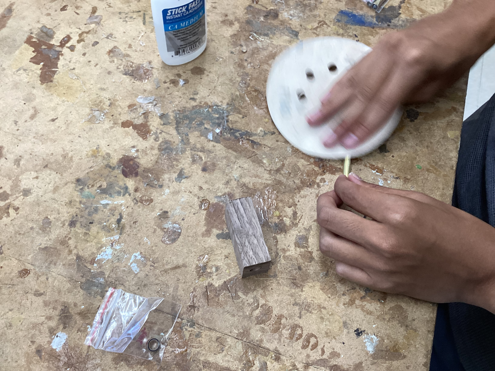

9-3-2025: Finished cutting all wooden blanks and glued the pieces together using wood glue.

9-4-2025: Drilled a hole through the glued wood blanks and inserted the metal shaft (pen insert).
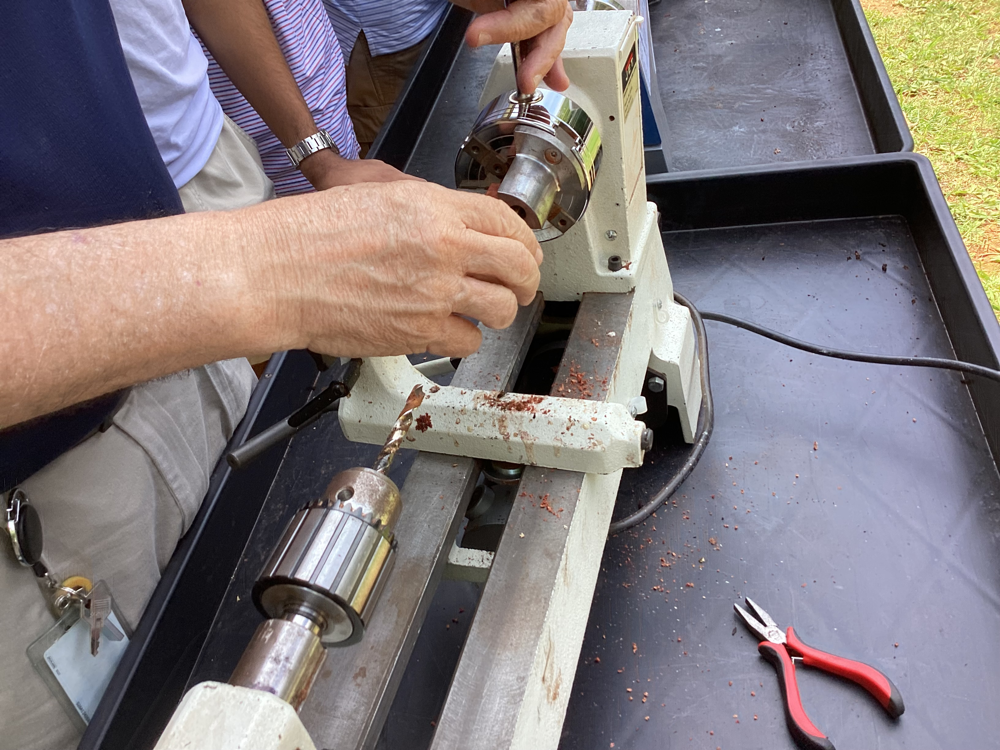

9-5-2025: Started turning the pen on the lathe and shaping it. Unfortunately, the wood cracked during turning, which meant I had to start over with a new blank.
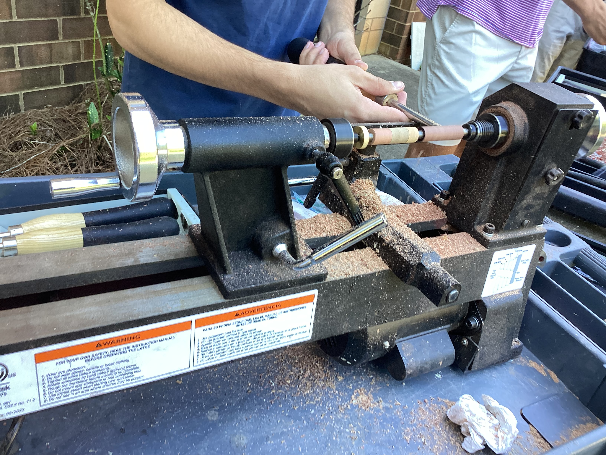

9-8-2025: Prepared and glued the new wood blank, then re-drilled the hole.

9-9-2025: Inserted the new metal shaft and began setting up a GitHub page to track my engineering work.

9-10-2025: Successfully turned the pen to the desired shape and sanded it down to a smooth finish.
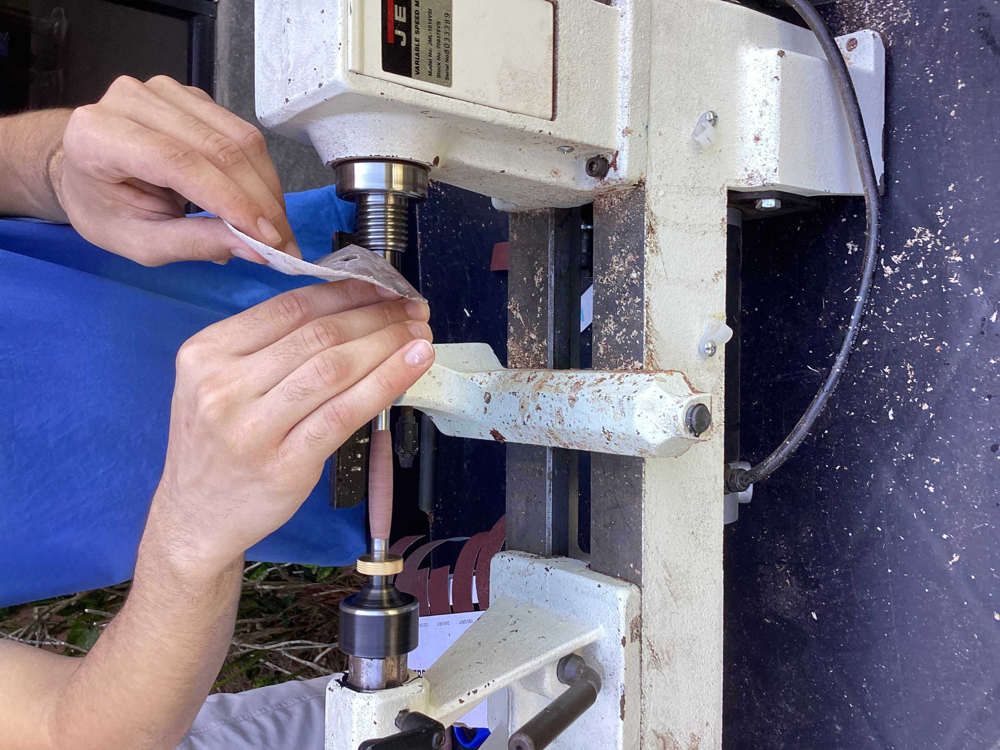
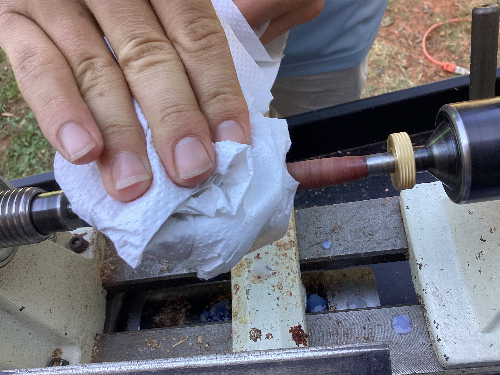

9-12-2025: Assembled the final pen with all components and tested its functionality.
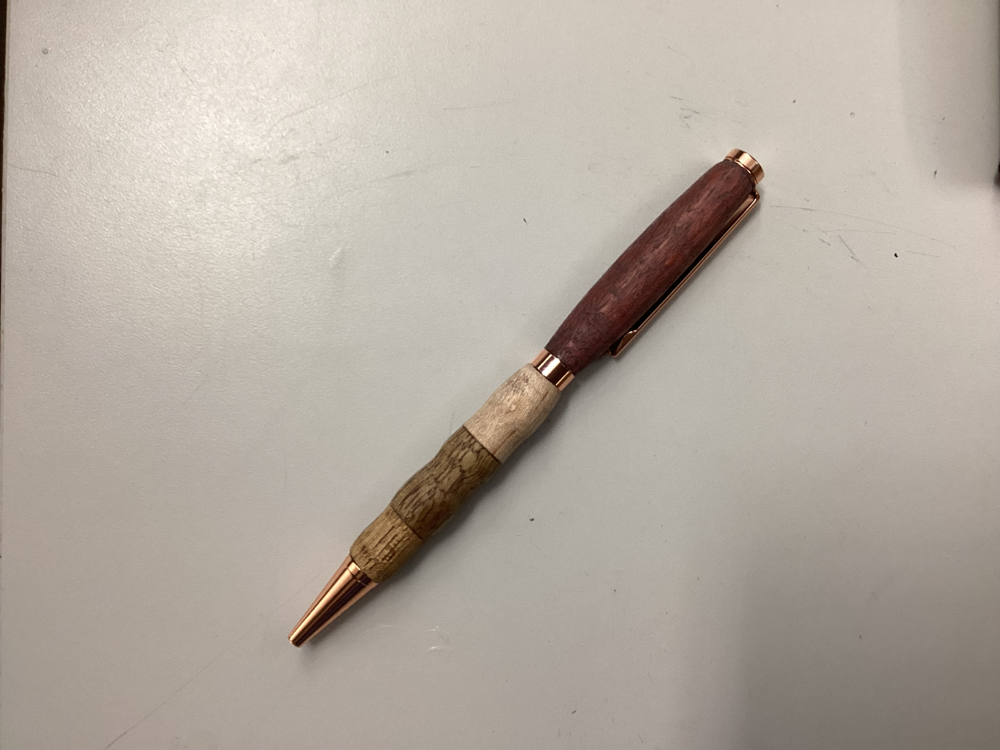

### Reflection:

This project taught me how to use the lathe safely and effectively. I learned the importance of patienc when the first piece cracked. Restarting allowed me to practice better pressure control during turning. I also gained experience in drilling, gluing, and assembling components.

---

# Soldering: The Owl Project

Dates: 9-28-2025 to 9-30-2025

### Process Summary:

9-28-2025: Practiced soldering on a test board with 3 resistors. Then began soldering the Owl Project PCB, starting with resistors, capacitors, and transistors.
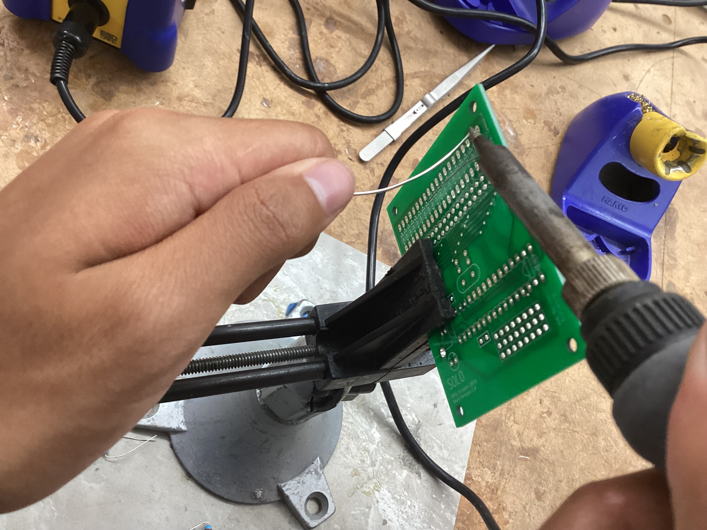
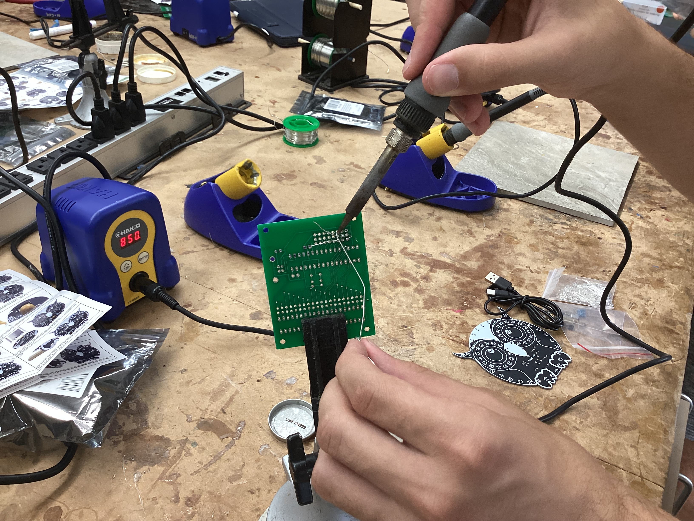

9-29-2025: Continued soldering LEDs onto the board.
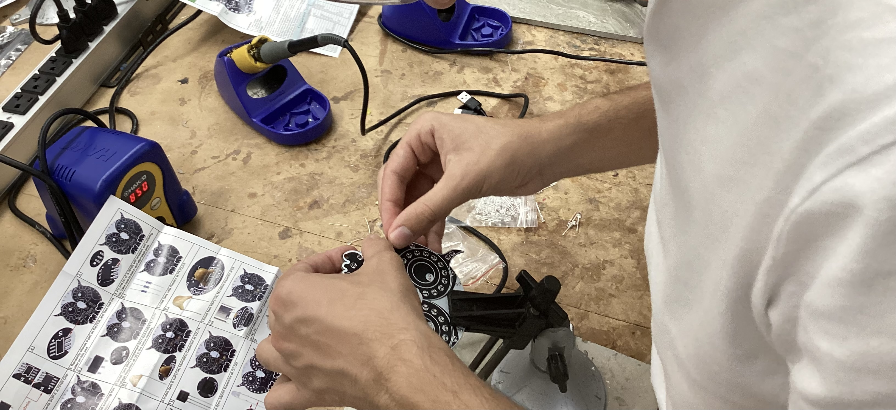

9-30-2025: Finished soldering all LEDs, the USB port, and ICs (integrated circuits). Final testing confirmed the board was functional.
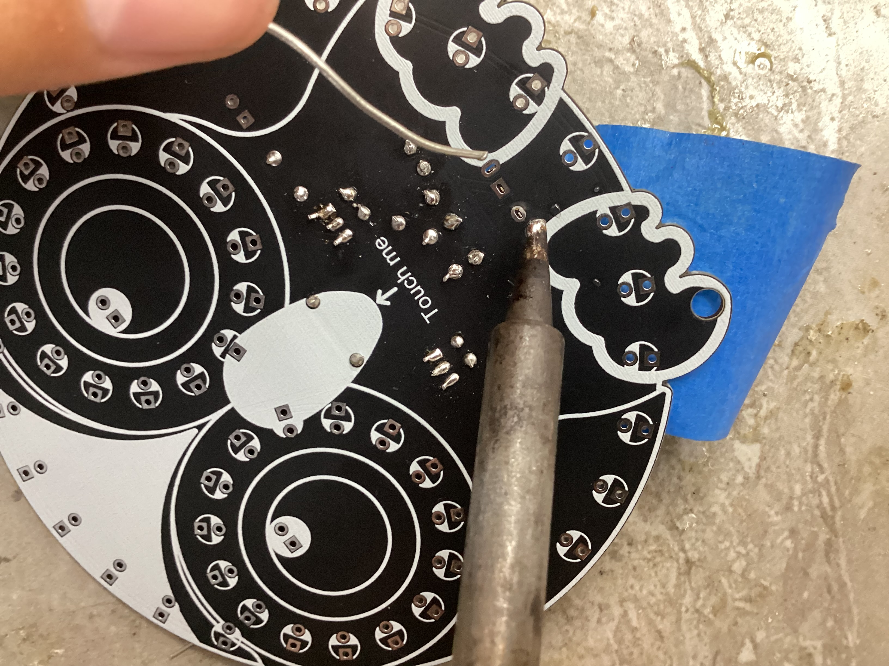

### Successes:

Successfully soldered all components with clean joints.

The Owl Project functioned correctly after first testing.

### Setbacks & Solutions:

Some solder joints were initially cold or uneven. I identified and reworked these using flux and re-heating.

One LED was initially installed backward, so I desoldered and reoriented it properly.

### What I Learned:

I improved my soldering precision and learned how to identify component orientation. This experience also taught me how to troubleshoot circuit boards and understand basic electronic components and their roles.

---

# GitHub Repository

Date Started: 9-9-2025
Description: I created a GitHub repository to document all of my engineering projects. It includes logs, pictures, and reflections.

# Capstone Project: Robotic Arm Cup Holder for Pearl Rehab Center

### Project Name: "Adaptive Arm-Based Beverage Delivery System"

### Description:

In collaboration with Pearl Rehab Center, I began designing an assistive device to help users with limited mobility access drinks more easily. This robotic arm is meant to hold and move a cup to the user.

### Bill of Materials
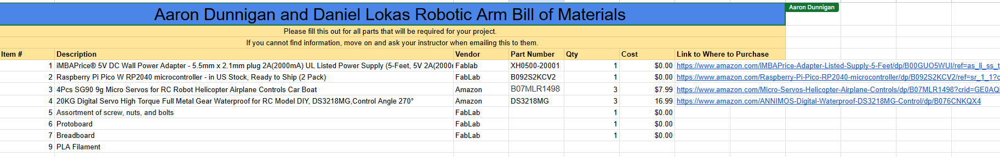

### Timeline:

9-18-2025: Committed to working with Pearl Rehab and started research on the types of assistive technologies already available.

10-1-2025: Researched various cup holder mechanisms and mounting systems.

10-6-2025: Researched different motors (servo) for the arm.

10-9-2025: Worked with Aaron to finalize design specifications and created the initial sketch for the robotic arm system.

10-10-2025: Practiced using all three laser cutters. Also 3D printed a sample car model to test printer functionality.

---

# What I've Been Working On

Aside from the listed projects i’ve spent time learning Fusion 360 and Tinkercad to create models that can be 3D printed. I’m also becoming more familiar with Arduino so that I can eventually control the robotic arm electronically. Our next steps will involve writing simple control code for motor movement and testing the assembly of the cup holder.
