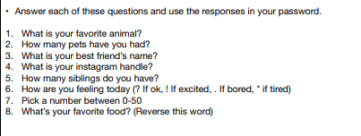
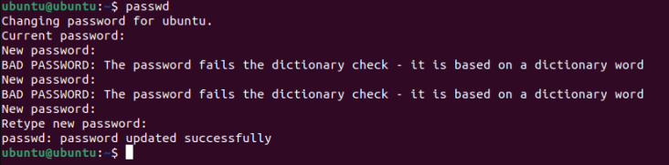
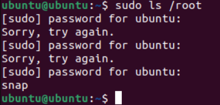
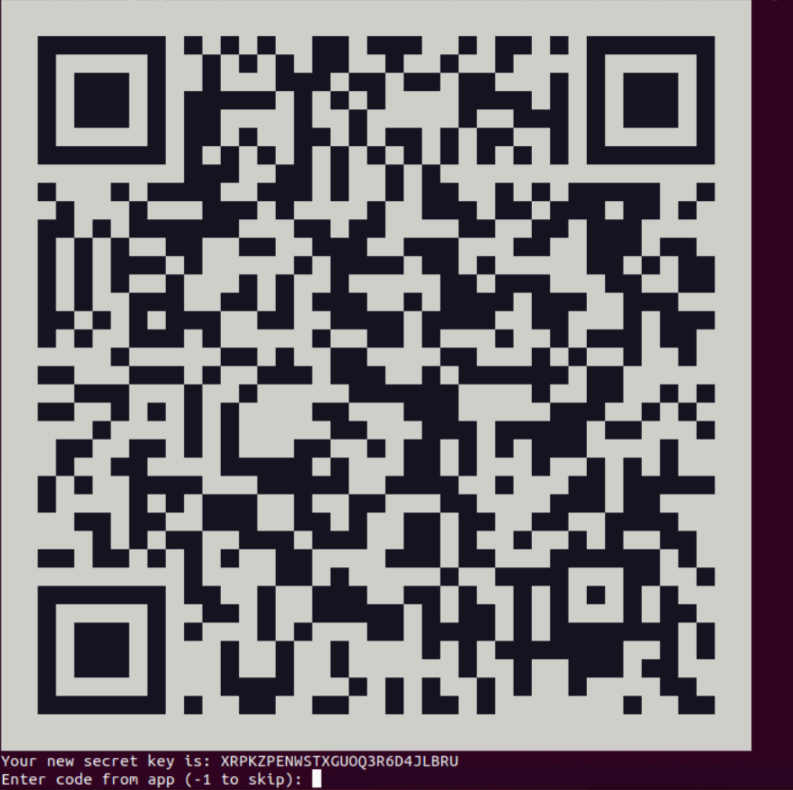
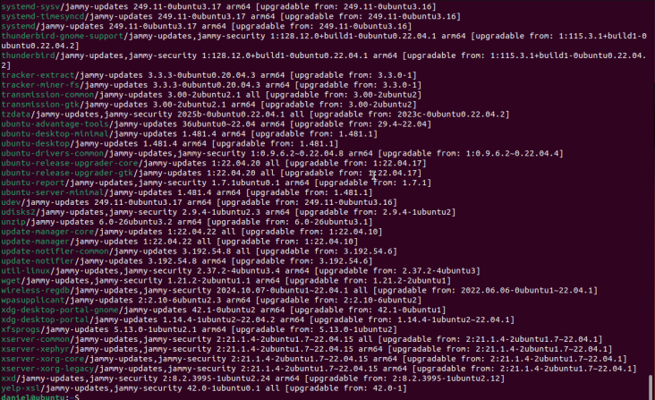
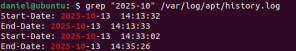
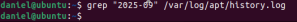
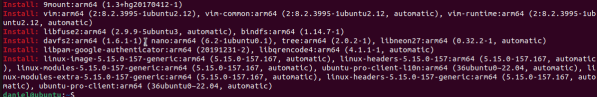

# **Digital Portfolio: Authentication & Device Security Implementation**

## **1. Planning & Design**

### Objectives
- Design a **strong password algorithm** focusing on length, entropy, and unpredictability.
- Apply the algorithm to **change the default Ubuntu password**.
- Install and verify **Multi-Factor Authentication (MFA) using `pam_google_authenticator`**.
- Perform **system updates and patches**, examining logs.
- Align password rules with **NIST SP 800-63B** and concepts from **OWASP Authentication Guidelines**.

### Planning Artifacts
- Drafted password algorithm using user-based prompts to generate complex outputs :contentReference[oaicite:0]{index=0}.
- Reflected on password strength and entropy (long + randomized + personal but non-public info).
- Identified commands needed for:
  - `passwd`, `sudo`, `apt update`, `apt upgrade`
  - `google-authenticator`, `SSH` config changes
- Noted importance of removing default credentials and implementing layered security.
- Took screenshots during each key step (password change, MFA, patch logs, etc.).

---

## **2. Technical Development**

### Password Algorithm
- Created an algorithm combining personal facts, numbers, symbols, and a reversed word.
- Tested the algorithm-generated password for usability and complexity.

### Change Default Ubuntu Password
- Logged in with default `ubuntu:ubuntu`.
- Ran `passwd` and successfully updated to algorithm-generated password :contentReference[oaicite:1]{index=1}.
- Verified using:  
  `sudo ls /root` → success.

### Install & Verify MFA (Google Authenticator)
- Installed `libpam-google-authenticator`.
- Ran `google-authenticator` and saved secret key & backup codes.
- Edited `/etc/pam.d/sshd` and `/etc/ssh/sshd_config` to enable MFA.
- Verified MFA by logging in via SSH and entering verification code.

### System Updates & Patching
- Ran `sudo apt update`, `sudo apt list --upgradable` ➝ identified available updates.
- Ran `sudo apt upgrade` ➝ applied patches.
- Used commands to log history:
  - `cat /var/log/apt/history.log`
- Counted installed packages, examined dates, tested specific package logs.
- Cited NIST password policy in documentation.

---

## **3. Testing & Evaluation**

### Password Testing
- Used `sudo` commands to confirm new password works.

### MFA Verification
- Successfully generated MFA codes.
- Verified MFA through SSH login prompt requiring second factor.

### Patch Log Reviews
- Inspected update history with `cat /var/log/apt/history.log`.
- Filtered by date and package name 
- Used `wc -l` to count installations and `tail -n 20` for recent updates.
- Identified last update date and total number of updates.

### Risk Evaluation
Discussed risks of:
- **Zero-day vulnerabilities**
- **Outdated packages**
- **Attackers exploiting unpatched systems**
- Real-world consequences (data theft, downtime, legal issues)

---

## **4. Reflection & Professionalism**

Cybersecurity works best when multiple layers of protection are used together. This project showed how password strength, MFA, and patching each add security in different ways. Strong passwords that follow NIST and OWASP guidelines are harder to guess because they are long, unique, and less predictable. Using an algorithm to create the password made it easier to follow a repeatable method instead of making random choices.

MFA with pam_google_authenticator added another layer so that even if a password is stolen, an attacker still cannot get in without the second code. Patching the system fixed security holes and removed outdated software that could be exploited. Logs made it clear how often updates happen and how dangerous it is to ignore them. Unpatched systems are at risk of zero-day attacks and real-world exploits that hackers actively search for.

In places like hospitals or businesses, poor authentication or missing updates can cause data loss, downtime, or serious security breaches. Professional cybersecurity means using strong passwords, enabling MFA, applying patches regularly, and following trusted standards to keep systems safe.

---

## Evidence & Screenshots 
- Password algorithm draft

- Successful `passwd` command screenshot

- Sudo verification screenshot

- MFA setup & SSH verification screenshot

- `apt update`, `apt upgrade` outputs

- History log screenshots with annotations

- Package count & recent update screenshots

---

## **Standards Referenced**
- Digital Identity Guidelines 
- OWASP Authentication Cheat Sheet
- Ubuntu Security & Patching Best Practices

---

## Next Steps
- Automate updates and monitor for patch failures
- Improve password algorithm usability
- Explore hardware-based MFA 
- Research centralized logging and alerting for authentication events

---
