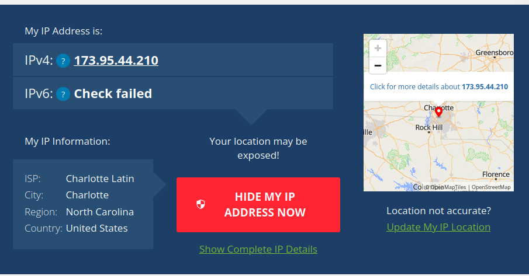

# Types of Networks & Connections & Devices

---

# Lesson 1 - Exploring IP Adresses

## Answer the following in complete sentences in a well-written paragraph on your digital porfolio:
1. Are your internal and external IP addresses the same or different?
2. Which IP belongs to your local network?
3. Which IP belongs to the internet?
4. Why might a virtual machine use Network Address Translation (NAT) when
connecting to the internet?
5. How does Shared mode make it easier to connect multiple virtual machines on one
computer?

The internal and external IP addresses are different. The internal IP belongs to the local network and identifies the virtual machine inside a home or school network. The external IP belongs to the internet and is assigned by the internet provider. A virtual machine uses Network Address Translation (NAT) to share the host computer’s internet connection, which helps it go online without needing its own public IP. Shared mode makes it easier to connect multiple virtual machines on one computer because they can all use the same internet connection safely and easily.

---

## The output of ip a in Shared (NAT) mode

---

## The output of ip a in Bridged mode

---

## The WhatIsMyIPAddress.com page results for both modes
### whatismyipdress.com IPv4 Shared Mode

### whatismyipdress.com IPv4 Bridged Mode
.png)

---

## Answer the following in complete sentences in a well-written paragraph on your digital
portfolio:
1. How did your internal IP address change when you switched to Bridged mode?
2. Did your external IP address change or remain the same?
3. In Bridged mode, does your virtual machine act more like a separate computer or a
computer behind another device?
4. Why might an organization choose Bridged mode instead of Shared (NAT) mode?
5. What security or management challenges could come with using Bridged mode?

When it was switched to Bridged mode, the internal IP address changed from 192.168.64.2 to 10.32.1.32, showing that the VM joined a new part of the local network. The external IP stayed the same because both modes used the same internet provider. In Bridged mode, the VM acts more like a separate computer on the network instead of being hidden behind the host. An organization might use Bridged mode to let virtual machines communicate directly with other devices. However, it can be less secure because each VM is fully visible on the network.

| Mode | Internal (Private) IP | External (Public) IP | Notes |
| :------ | :------- | :------- | :------- |
| **Shared(NAT)** | 192.168.64.2/24 | 173.95.44.210 | The Internal and Extrenal are different but the external for bridged and shared are the same |
| **Bridged** | 10.32.1.32/23 | 173.95.44.210 | internal and external are very different |

---

## Write a short paragraph (5–7 sentences) beneath your table addressing the following:
• Which mode made your VM appear as its own device on the local network?
• Which mode provided a safer, more controlled environment?
• How does NAT help manage limited IPv4 addresses and improve security?
• What did you learn about how data travels from a device to the internet?

Bridged mode made the VM appear as its own device on the network. Shared (NAT) mode provided a safer, more controlled setup because it hides the VM behind the host computer. NAT helps save IPv4 addresses by letting many devices share one public IP while keeping their private addresses separate. It also adds security by blocking outside access. Data travels from a local device through the router (and sometimes NAT) before reaching the internet and coming back to the right device.

---

## Write a short reflection (1 paragraph, 5–8 sentences) below your screenshots that answers these:
• How did your IP addresses change between Shared and Bridged mode?
• What did this experiment teach you about how local and public networks communicate?
• Why might IT professionals use different network configurations for home, business, or
lab environments?
• Which mode do you think is best for classroom use, and why?

When switching between Shared and Bridged mode, the internal IP changed, but the external IP stayed the same. This showed how local and public networks work together through routers and IP translation. IT professionals use different network setups for safety, testing, or direct access. For classroom use, Shared (NAT) mode is better because it’s safer and easier to manage. This activity taught how devices connect to each other and the internet.

# Lesson 2 — Network Topologies

---

## Part 1: Topology Diagrams

---

## Star Topology
**Description:**  
A central device (switch or hub) sits in the middle, and all computers connect directly to it. This structure makes it easy to manage, expand, and troubleshoot.

**Screenshot:**  

---

## Bus Topology
**Description:**  
A single main cable, known as the backbone, runs horizontally with each device branching off using a short perpendicular connection. All devices share the same communication line.

**Screenshot:**  

---

## Ring Topology
**Description:**  
All devices form a closed loop, with each device connected to two neighboring devices. Data travels around the ring in one direction, or in both directions in a dual-ring setup.

**Screenshot:**  

---

## Mesh Topology
**Description:**  
Every device connects to multiple others, creating multiple data paths throughout the network. This design offers high redundancy and excellent reliability.

**Screenshot:**  

---

## Hybrid Topology
**Description:**  
A combination of two or more topology types. An example is several star networks connected together through a bus or ring structure, providing both flexibility and scalability.

**Screenshot:**  

---

## Reflection Paragraph

The easiest topology to set up for a small business is the star topology because it requires only one central switch and simple point-to-point connections, making it straightforward to install and maintain. The most reliable topology when a single connection fails is the mesh topology since it provides multiple paths for data, allowing communication to continue even if one link goes down. The most expensive topology to implement is also the mesh topology due to the large number of cables and connections needed to link every device to multiple others. I believe my school most likely uses a hybrid topology because large organizations typically combine multiple star networks or other configurations to support different buildings, departments, and floors while maintaining speed and reliability. The physical layout of a topology affects network performance because shorter, more direct paths reduce congestion and improve speed, while redundant layouts improve reliability by ensuring that data can still travel even if a cable or device fails. Overall, the topology chosen has a major impact on cost, speed, scalability, and reliability in any network environment.

# Lesson 3 - Cable Constructing and Testing 

---

## Part 1: Required Photos and Videos

---

## Photo #1 — Stripped Cable (Four Twisted Pairs Visible)

---

## Photo #2 — Wires Arranged in T568B Order

---

## Photo #3 — Wires Inserted Into RJ45 Connector (Before Crimping)

---

## Photo #4 — Completed Cable Ends (Both Sides)

---

## Video #1 — Stripping Demonstration

---

## Photo #5 — Cable Tester Results

---

## Video #2 — Cable Testing Demonstration

---

## Photo #6 — T568A vs T568B Comparison 

---

## Part 2: Reflection Paragraph

The most challenging step in creating my Ethernet cable was arranging the wires neatly in the correct T568B order, because keeping the pairs straight, flat, and aligned while preventing them from springing out of place required patience and precision. Maintaining the correct wire order is critical for network reliability because Ethernet communication depends on specific pins handling transmit and receive signals; even a single misordered wire can cause signal loss, failed connections, or reduced performance. This hands-on process directly connects to the Physical Layer (Layer 1) of the OSI Model, which is responsible for transmitting electrical signals through copper wires, and building the cable showed how the physical medium determines whether those signals can travel correctly. If a cable were built incorrectly but never tested, a real network could experience intermittent failures, slow speeds, or complete device disconnection, leading to troubleshooting delays and unnecessary equipment replacement. Labeling my cable and using professional tools mirrored real-world industry standards, where technicians must ensure accuracy, durability, and traceability of every cable before installation. This process demonstrated how careful construction, proper testing, and clear labeling form the foundation of reliable network infrastructure.

# Lesson 4 - Network Interface & OSI Layer Lab Report

---

## Screenshot 1: `ip link show`

### Recorded Info
- **Interface name:** enp0s1  
- **MAC address:** 1a:63:23:39:a4:2c  
- **Broadcast address:** ff:ff:ff:ff:ff:ff  

### Explanation
The `ip link show` command lists all network interfaces on my Ubuntu VM. The active interface, **enp0s1**, is my virtual network card. The MAC address uniquely identifies my VM’s network interface on the local network, while the broadcast address is used to send data to all devices on the same LAN.

---

## Screenshot 2: `arp -n`

### Explanation
The `arp -n` command displays the ARP (Address Resolution Protocol) table, which maps IP addresses to MAC addresses. Each entry represents a device my VM has recently communicated with. ARP helps my computer determine which MAC address corresponds to which IP address so data can be correctly delivered on the local network.

---

## Screenshot 3: `ip -s link` or `sudo ethtool enp0s1`

### Explanation
This command shows how many packets have been sent (TX) and received (RX) on my active interface. It may also include error counts, connection speed, and duplex mode. My results indicated a **1000Mb/s full-duplex** connection, meaning data can flow both directions simultaneously. The packet counts show how active my VM’s network connection has been.

---

## Screenshot 4: `sudo tcpdump -c 5`

### Explanation
This command captured five packets of live network traffic. Each packet displays a **source MAC address** (sender) and a **destination MAC address** (receiver). The captured traffic included ARP and IP packets, showing that my VM was exchanging basic network information and possibly ping responses. This demonstrates how data physically moves between devices at OSI Layers 1 and 2.

---

## Reflection
In this lab, I learned how my Ubuntu VM communicates on the network using its interface and MAC address. The MAC address acts as a permanent hardware identifier, while the IP address can change and is used at a higher layer for routing. ARP links these two systems by mapping IP addresses (Layer 3) to MAC addresses (Layer 2), allowing my VM to send frames to the correct device on the local network.

Viewing live packets with `tcpdump` allowed me to see actual frames being transmitted, including source and destination addressing. This clarified how the **Physical Layer (Layer 1)** transmits raw bits while the **Data Link Layer (Layer 2)** frames those bits and ensures they reach the correct destination. Together, they form the foundation for all network communication.

---

## What Was Learned About OSI Layers 1 & 2
Layers 1 and 2 work together to enable reliable communication between devices:

- **Layer 1 – Physical Layer:** Handles the actual transmission of bits through electrical signals over cables or wireless frequencies.
- **Layer 2 – Data Link Layer:** Packages data into frames and uses MAC addresses to deliver data to the correct device on a local network.

Commands such as `ip link show`, `ethtool`, and `tcpdump` provided insight into what happens beneath the surface when connecting to the internet. Understanding these layers is essential for troubleshooting, network setup, and recognizing how data moves from one device to another.

# Leson 5 - Building and Testing a SOHO Network

---

## Part 1: SOHO Network Diagram

## Network Explanation
My SOHO network is designed to balance reliability, organization, and realistic device placement using the 192.168.50.0/24 addressing scheme. The router serves as the gateway for all devices and holds the static address 192.168.50.1, while the switch expands the number of wired ports for the Ubuntu computers, printer, and NAS. The access point provides wireless coverage for mobile devices like the smartphone, tablet, and IoT device. The printer and NAS use static IP addresses so they remain easy to locate on the network, while the computers and wireless devices receive their addresses automatically through DHCP. Each connection was chosen to reflect real-world setups: wired links for stationary and bandwidth-intensive devices, and wireless links for mobile or convenience-based devices. This design creates a stable, organized, and scalable SOHO network that mirrors those used in homes and small offices.

---

## Part 2: Ubuntu Network Simulation

## Screenshot #1 — Partner IP Addresses

## Screenshot #2 — Successful Ping Results

---

## Part 3: Network Diagnostic Commands

### Explanation
These diagnostic commands reveal how devices communicate across the SOHO network. The `arp -a` command shows nearby devices and their MAC addresses, demonstrating how Layer 2 handles local communication. The `netstat -r` command reveals the routing table, showing how data chooses its path according to Layer 3. Commands like `traceroute` show how packets travel across multiple networks, reinforcing how routing decisions move data beyond the local network.

---

## Part 4: Firewall Configuration

## Screenshot — Firewall Status (ufw active)

### Firewall Explanation
Enabling the firewall protects the system by filtering incoming network traffic, allowing only trusted or permitted connections. This prevents unauthorized access and adds a layer of security to the SOHO network.

---

## Part 5: Traceroute Results

## Screenshot — Traceroute Output

### Traceroute Summary
The traceroute output shows the number of hops and routers my packets travel through before reaching the destination. This demonstrates how data moves across multiple networks, even for a simple request, and highlights how routing devices guide traffic through the internet.

---

## Part 6: Application Layer Activity — Simple Web Server

## Screenshot — Web Browser Showing Shared Files

“This demonstrates the Application Layer by showing how one device can serve files to another over HTTP.”

---

## Reflection Paragraph

This lesson demonstrated how devices communicate on a network by allowing me to design a complete SOHO layout and then test real connectivity using Ubuntu virtual machines. OSI Layers 1 through 3 were actively involved throughout the lab: Layer 1 handled the physical and wireless connections, Layer 2 managed MAC addressing and local communication shown through commands like `arp -a`, and Layer 3 controlled IP routing, visible in the routing table and the path traced by `traceroute`. Enabling the firewall reinforced how security controls filter traffic and protect systems from unauthorized access. The traceroute results were especially surprising because they revealed how many routers and networks my data travels through before reaching something as simple as Google. The web server activity demonstrated how real websites operate, with one device hosting content and another accessing it through an HTTP request. If this were my own home network, I would add an additional access point for stronger coverage, set more static IPs for critical devices, and implement stronger firewall rules to improve reliability and security.

