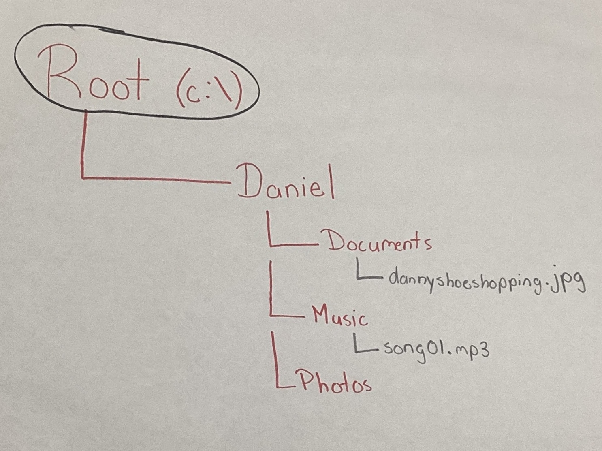

# Objectives for Activities:
- Map the Maze (Part 1): Learn file system structures and how to represent them as diagrams.
- Ubuntu Tutorial: Learn how to use VM using Ubuntu. 
- Map the Maze (Part 2): Practice core commands for navigating and creating files in Ubuntu.
- House Sitting Adventure: Test CLI knowledge in a simulated scenario with challenges, hidden files, and troubleshooting.

---

# 1. Planning & Design (Map the Maze Part 1, Ubuntu Tutorial)
This project focused on understanding the structure of a file system through diagramming and pseudocode. Students planned a folder hierarchy and outlined basic command-line operations like creating directories, adding files, and moving them. This step emphasized the importance of visualizing and logically organizing file systems before executing real commands in a CLI environment.

**Purpose of CLI Work:** 
The Command Line Interface (CLI) allows users to navigate, create, organize, and share files without relying on interfaces. 

**File System Tree:**  

**Pseudocode for CLI Navigation & File Manipulation:**  
1. Start at home directory (cd ~).
2. Create new folder "Practice" (mkdir Practice).
3. Inside "Practice", create subfolders: Docs, Photos, Music.
4. Create a text file "notes.txt" inside Docs (touch notes.txt).
5. Move "notes.txt" into Music folder (mv notes.txt Music/).
6. Verify structure with ls and tree.
7. Record the full path of Music folder (pwd).

**Reflection on Planning:**  
Creating both a diagram and pseudocode provided a clear roadmap before using actual commands. Planning ensured that I understood the logic of how folders and files connect, making later execution more accurate and efficient

---

# 2. Technical Development (Map the Maze Part 2)
In this phase, the planned file structure was implemented in a real Ubuntu terminal. Students practiced key commands such as mkdir, touch, cd, pwd, and nano to navigate and manipulate files. Files were also transferred to the host machine using cp, demonstrating integration between systems. 

**Tools Used:** 
- Ubuntu VM (guest OS)
- Terminal (CLI environment)
- Hostshare (for file transfer between Mac and VM)

**Commands & Outputs:**  
pwd
  /home/ubuntu

cd Documents
pwd
  /home/ubuntu/Documents

mkdir MazeGame
cd MazeGame
ls
  (empty)

touch clue1.txt clue2.txt clue3.txt
ls
  clue1.txt clue2.txt clue3.txt

nano clue1.txt
  Edited text: "Hello my name is Daniel!"

cp clue1.txt ~/hostshare/
ls ~/hostshare
  clue1.txt now visible in Mac host

**Result:**  
All required commands were executed correctly, with organized documentation of outputs and reasoning

---

# 3. Testing & Evaluation (House Sitting Adventure)
This challenge-based activity tested the user's CLI skills in a simulated real-world scenario. Tasks included verifying files, deleting items, revealing hidden files, and editing documents. The project emphasized troubleshooting, validation, and adaptability in using command-line tools.

**Example Test Cases:** 
### Test 1 – Verify Created Files
cd kitchen
ls
  apple banana cereal crackers donut milk orange

✅ Confirmed all files appeared as expected.

### Test 2 – Remove Files and Confirm Deletion
rm orange milk
ls
  apple banana cereal crackers donut

✅ Files successfully removed.

### Test 3 – Reveal Hidden Items
ls -a
  . .. .rotten_bananas apple banana cereal crackers donut
rm .rotten_bananas
ls -a
  . ..

✅ Hidden file detected and deleted.

### Test 4 – Copying and Editing Files
cd main_entrance
touch note.txt
nano note.txt
  "Thanks for trusting me to watch your house!"
ls
  instructions.txt note.txt

✅ Verified file creation and editing.

## Bug / Correction Example

At one point, I tried rm orange, milk (with a comma), which failed. Corrected to rm orange milk (space-separated arguments).

Result:
Multiple tests confirmed the accuracy of commands. Before-and-after outputs proved changes, and errors were acknowledged and fixed

---

# 4. Reflection & Professionalism
The portfolio demonstrates how file systems function as hierarchical structures and how the CLI can be used to manage them effectively. Unlike a graphical interface, the CLI uses commands but is more efficient. The activities provided hands-on practice with creating, moving, deleting, and revealing files, helping establish key concepts of file system navigation.

Common challenges included syntax errors and remembering operations such as rm -r. However, correcting these mistakes contributed to a deeper understanding of the commands. Overall, the experience strengthened technical accuracy, problem-solving skills, and professional documentation practices.

---

# 5. Troubleshooting Network Issues
This activity focused on diagnosing and resolving internet connectivity problems on both a Mac and an Ubuntu VM. The process followed a logical flow: checking IP configuration, testing connectivity to known servers, verifying router connections, and confirming DNS functionality. Students compared networking modes (Shared vs. Bridged) in the VM to understand how devices interact on different networks.

## Key Steps and Findings
Checking IP Address:
- On Mac: Observed private IP ranges (10.x.x.x and 192.168.x.x). When disconnected from Wi-Fi, the IP disappeared; when reconnected, it returned.
- On Ubuntu (Shared mode): 192.168.64.2 (hidden behind the Mac).
- On Ubuntu (Bridged mode): 10.24.0.157 (acted as a separate device).

Testing Reachability:
- Pinging Google DNS (8.8.8.8) succeeded with ~325ms.
- Pinging Cloudflare DNS (1.1.1.1) succeeded with ~7ms, showing faster response.
- Confirmed router gateway ping was faster than public DNS, which makes sense since it is closer.

Testing DNS:
- Pinging google.com and other websites succeeded, proving DNS resolution worked.
- If numeric IPs worked but domain names failed, the issue would be DNS-related.

## Mode Comparion (Shared vs Bridged): 
- Shared Mode (NAT): VM hides behind the host Mac, easier for IT management and safer for classroom environments.
- Bridged Mode: VM gets its own IP and acts like a standalone device, but has greater security risks in school networks.

## Troubleshooting Flow (4 Steps):
1. Check if device is connected.
2. Verify if it has a valid IP address.
3. Test if it can reach the internet (e.g., 8.8.8.8).
4. Confirm if DNS can resolve website names.

## Reflection:
The most useful step was Testing DNS, as it allowed practice in checking whether connectivity problems were due to the internet connection itself or simply domain resolution. Exploring Shared vs. Bridged networking clarified how virtual machines interact with networks and highlighted the security trade-offs of each mode. Overall, this assignment strengthened problem-solving strategies for real-world connectivity issues.

---
