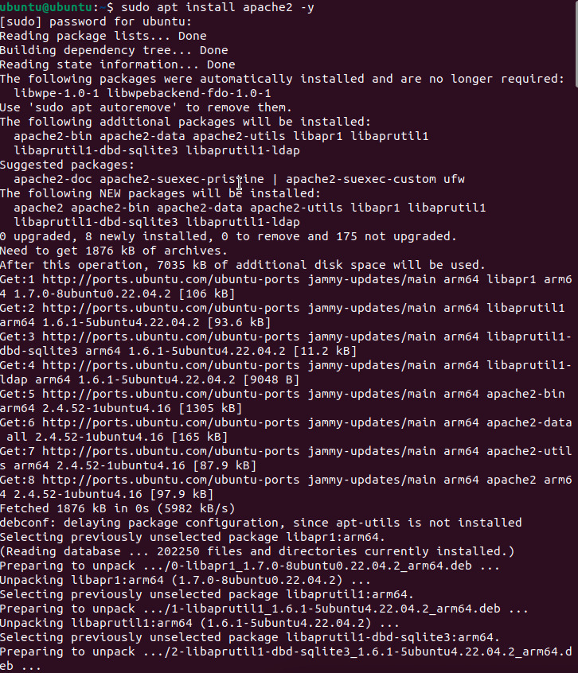

# **Assignment 1: Cybersecurity Basics for Devices**

### **Planning & Design**
The goal of this assignment was to identify vulnerabilities on an **Ubuntu VM**, secure it using a **firewall**, and evaluate **encryption**. The objectives included:

- Scanning for open ports
- Enabling and configuring **UFW**
- Blocking insecure services (e.g., **Telnet**)
- Checking disk encryption status

This aligns with the **CIA triad** by improving:
- **Confidentiality** (through encryption)
- **Integrity** (by disabling unnecessary services)
- **Availability** (by ensuring required services remain online)

---

### **Technical Development**
1. I used the command:
    ```bash
    netstat -tuln
    ```
    This identified open ports.

**Necessary Ports Identified:** SSH (22), DNS (53), DHCP (68)

**Unnecessary Ports Identified:** CUPS (631), discovery services (5353), high ports (9843, 53443, 59686)

2. Installed and enabled **UFW firewall**:

    ```bash
    sudo apt update && sudo apt upgrade
    sudo apt install ufw -y
    sudo ufw enable
    ```

3. Blocked insecure **Telnet**:

    ```bash
    sudo ufw deny 23/tcp
    ```

4. Checked disk encryption:

    ```bash
    lsblk -f
    ```
    Output showed only ext4 and vfat, meaning **no LUKS encryption**.

#### **Outputs**
.png)

.png)
.png)

---

### **Testing & Evaluation**
**UFW** was enabled and firewall rules applied successfully.

Ports were analyzed for risk; **SSH (22)** was the most likely attack target due to brute-force attempts.

**Telnet** was blocked to prevent plaintext credential attacks.

Disk encryption was not enabled, which is acceptable for a classroom VM but **unsafe** for real-world laptops.

---

### **Reflection & Professionalism**
This assignment demonstrated how security controls directly protect devices:

- Every open port represents a **potential risk**.
- Firewalls act as a security guard for network traffic.
- **Encryption** ensures confidentiality, keeping data safe even if stolen.

I gained professional experience in configuring Linux firewalls with **UFW** and learned why insecure protocols like **Telnet** must be disabled. This directly connects to enterprise cybersecurity practices, where system administrators **harden endpoints** before deployment.

***
***

# **Assignment 2: Outdated Software Log**

### **Planning & Design**
The purpose of this assignment was to analyze installed software for outdated versions, evaluate the risks, and update them.

**Planned steps:**

1. Run version-check commands:

    ```bash
    openssl version
    firefox --version
    libreoffice --version
    python3 --version
    apache2 -v
    gimp --version
    java -version
    ssh -V
    ```

2. Compare installed versions with the latest releases.
3. Mark results as up-to-date or outdated.
4. Use `sudo apt update && sudo apt upgrade -y` before testing.

---

### **Technical Development**
1. Checked and recorded software versions in the log.
2. **OpenSSL** was identified as the most dangerous if outdated, since it could allow attackers to break encryption.
3. Updated **Java** and confirmed installation with `java -version`.

#### **Outputs**

.jpg)

---

### **Testing & Evaluation**
Outdated applications were detected and upgraded.

**Risks identified:**

- **OpenSSL**: could expose encrypted communications.
- **Apache/Java**: could allow remote code execution or malware injection.
- **GIMP/LibreOffice**: potential for malicious file exploits.

Updates were applied to eliminate vulnerabilities.

---

### **Reflection & Professionalism**
This assignment reinforced the importance of **patch management** in cybersecurity.

- **Outdated software** is a common attack vector.
- Schools, hospitals, and businesses must update regularly to protect sensitive data and ensure compliance.
- On a real laptop, outdated programs could lead to **malware, identity theft, or full system compromise**.

I concluded that **OpenSSL** was the most critical to update, since weak encryption undermines the security of all communications. This connects directly to real-world cybersecurity work, where keeping systems **patched** is the first line of defense.

# **Assignment 3: Guided Notes – Cybersecurity Basics for Devices**

### **Planning & Design**
The purpose of this assignment was to create **guided notes** that summarize key cybersecurity concepts, provide analogies, and include **hands-on practice steps**. These notes were designed as a study and teaching tool to reinforce concepts such as the **CIA triad**, **device vulnerabilities**, **CVE tracking**, and **social engineering attacks**.

**Planned focus areas included:**
- Understanding the **CIA Triad** (Confidentiality, Integrity, Availability)  
- Identifying **device vulnerabilities** (outdated software, weak passwords, open ports, unpatched systems)  
- Learning how to check **system versions** on Ubuntu and macOS  
- Tracking vulnerabilities through **CVE reports**  
- Reviewing **social engineering tactics** and corresponding defenses  

---

### **Technical Development**
1. **CIA Triad Notes**  
   - C = **Confidentiality** (keep data secret)  
   - I = **Integrity** (keep data accurate & trustworthy)  
   - A = **Availability** (keep data usable when needed)  
   - Examples and analogies were included to make these ideas more memorable.  

2. **System Version Checks**  
   - On **Ubuntu**, ran:  
     ```bash
     uname -a
     ```  
     → Output shows kernel version, build date, and system type.  

   - On **Mac**, ran:  
     ```bash
     system_profiler SPSoftwareDataType
     ```  
     → Output shows macOS version, kernel version, and build number.  

   These steps highlighted why version checks matter for patching and security.  

3. **Common Device Vulnerabilities**  
   - Outdated operating systems → compared to not fixing broken locks.  
   - Weak passwords → like leaving the front door unlocked.  
   - Open ports → like doors/windows into a system (Port 80 = HTTP, Port 443 = HTTPS, Port 22 = SSH, Port 25 = SMTP, Port 110 = POP3, Port 143 = IMAP, Port 3389 = RDP, Port 53 = DNS).  
   - Unpatched software → explained as ignoring safety recalls.  

4. **Vulnerability Tracking (CVE)**  
   - Defined **CVE** as a global dictionary of known software flaws.  
   - Analogy: CVEs are like a “Most Wanted List” for vulnerabilities.  

5. **Social Engineering Attacks**  
   - Phishing = mass emails tricking users.  
   - Spear Phishing = targeted attacks.  
   - Pretexting = creating a false story.  
   - Baiting = offering free items/media.  
   - Tailgating = entering secure areas without authorization.  

6. **Defenses**  
   - Firewalls, Antivirus, Strong Passwords, Regular Updates, Security Training.  

#### **Outputs**
- Guided Notes included **fill-in-the-blank sections, analogies, and step-by-step tasks**.  
- Concept maps and structured outlines helped organize cybersecurity concepts.  

**Concept Map Placeholder:**  
.jpg)  

---

### **Testing & Evaluation**
The guided notes were effective for:  
- Reinforcing technical commands by requiring **hands-on checks** on Ubuntu and Mac.  
- Encouraging reflection through **discussion prompts** about risks of not updating.  
- Connecting vulnerabilities to **real-world analogies** for better recall.  

This made it easier to identify security risks such as **outdated operating systems**, **weak passwords**, and **open ports**.  

---

### **Reflection & Professionalism**
This assignment deepened my understanding of cybersecurity by blending **theory, hands-on practice, and teaching tools**.  

Key takeaways:  
- The **CIA triad** is the foundation of all security measures.  
- Every outdated or unpatched system represents a **serious risk**.  
- **Social engineering** shows that people, not just technology, are a critical vulnerability.  
- By creating guided notes, I practiced not only learning but also **communicating cybersecurity concepts clearly**—a vital professional skill.  

This assignment highlights how strong documentation and guided instruction are just as important in cybersecurity as the technical controls themselves.  
